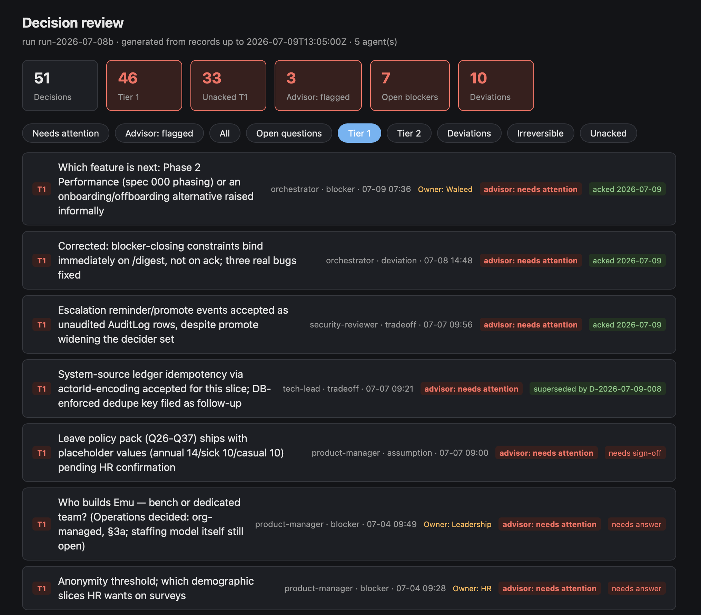

import { Code } from 'astro:components';
import promptText from './ai-agent-decision-funnel-prompt.txt?raw';

I was working on an exploration project where I was trying to build a replica of 2 tools I used daily at work to understand if SaaS really is dead and if SaaS costs
are redundant and can be countered cheaply - I can feel that grin :) so more on this some other time. The scope was humongous, and staying in the loop all the time meant I was the bottleneck and the project might never 
finish(it still likely wont finish), so I decided to give the agents more autonomy. I asked them to make the decisions, but log everything, make ADRs, make specs, and document the tasks so that I could review
them later at my pace.

## The agent roster

To move fast, I spun up a team of specialized agents running in parallel git worktrees:
- **Product Manager & Architect** (running Opus) to turn ideas into specs and ADRs.
- **Tech Lead** (running Opus) to decompose those specs into tasks.
- **Backend, Frontend, Migration, and QA Engineers** (running Sonnet) to implement the specs.

Every time they worked, they followed a structured orchestration model: specs → ADRs → backlog → parallel execution → review. Because they were running concurrently, the volume of code, specs, and review notes was massive.

So it worked! Actually a little too well for my liking. Every time I opened the repository, there was another stream of commits, specifications, ADRs and review notes waiting for me. 
The work was moving forward, but I was slowly losing the ability to tell whether it was moving in the right direction because there was too much to review. I would carefully review a few things, 
get tired, and then start rubber-stamping the rest because of the review fatigue. 

I soon realized it's not going to scale. It was difficult for me to decide what actually needed my attention and what didn't. 
My reviews also caught many mistakes that needed to be fixed. However, most of the time it was just an FYI for me, adding no value. It was confusing, do I acknowledge my limits and accept that I am the bottleneck? 
Or do I just let it be, vibe code the whole thing and just validate the end product? 

Fortunately that day, I also tuned in to the latest podcast by Pragmatic Engineer with Kent Beck which made me realize that a 
major part of what we do as engineers is to build trust in what we deliver, and it resonated with me. 
So staying out of the way with little to no trust in the end product wasn't the right answer.

## Operating at a higher level
After reflecting on this experience and Kent's experience from the podcast for a couple of days, it occurred to me that similar things have happened before 
when high-level languages came in. What did engineers do? Engineers just started operating at a higher level. 
So what is that higher level now?

An interesting thought made me excited. AI is supposed to do things intelligently. 
The useful question might not be, “What did the agents do?” That is trivial, especially with the latest agentic engineering techniques and validations. It is ultimately going to reach the goal you defined.
For me as an engineer who is looking to increase confidence in the product, the question essentially is, “Where did the agent make a decision that I might regret?” So, what if we 
consider this decision-making as the next abstraction? What if we start reviewing the decisions it made, and based on those reviews, give feedback on its judgment and ask it 
to improve on that aspect? 

That led to what I now call the **decision funnel**: an append-only ledger where agents record decisions as they make them.

## Decision Funnel

The ledger separates decisions into three groups:

- **Tier 1:** irreversible, security-sensitive, or specification-changing decisions that need human sign-off. Anything is reversible now—"irreversible" means that reversing it might shake foundations at an extremely high cost.
- **Tier 2:** reversible decisions with non-obvious costs.
- **Tier 3:** routine choices such as naming, linting, and mechanical refactoring.

Most decisions are Tier 3. I do not need to spend human energy deciding whether an agent picked the perfect variable name. I can even get another intelligent agent based on Fable 5 to go through them.
To make it intuitive, I asked it to output HTML and add a button to mark the decision reviewed. The simpler solution Fable 5 came up with was to copy a command to the clipboard, which I can just paste in to Claude Code although I am sure, there can be a better way.

## How to run this yourself (The System Prompt)

To implement this, you can equip your agents with a system instruction that forces them to write to a central ledger whenever they make a choice. Here is the generic prompt I used:

<b>Click to expand the System Prompt</b>

<button 
  onclick="navigator.clipboard.writeText(this.nextElementSibling.querySelector('code').innerText).then(() => { this.querySelector('.btn-text').innerText = 'Copied!'; setTimeout(() => this.querySelector('.btn-text').innerText = 'Copy Prompt', 2000) })"
  style="background-color: var(--color-blue); color: #ffffff;"
  class="absolute right-4 top-14 z-10 flex items-center px-3 py-1.5 text-xs font-semibold rounded-md shadow-md cursor-pointer hover:bg-opacity-95 hover:scale-[1.02] active:scale-[0.97] transition-all duration-150">
  <svg class="w-3.5 h-3.5 mr-1.5 opacity-90" fill="none" stroke="currentColor" stroke-width="2" viewBox="0 0 24 24" xmlns="http://www.w3.org/2000/svg" style="display: inline-block; vertical-align: middle;">
    <rect x="9" y="9" width="13" height="13" rx="1.5" ry="1.5"></rect>
    <path d="M5 15H4a2 2 0 0 1-2-2V4a2 2 0 0 1 2-2h9a2 2 0 0 1 2 2v1"></path>
  </svg>
  Copy Prompt
</button>

  <Code code={promptText} lang="yaml" themes={{ light: 'solarized-dark', dark: 'solarized-light' }} />

## What still belongs to the human?

I am still figuring this out in my own workflow. I don’t think there is a clean, final architecture for working with agents yet, but three lessons feel real:

1. **Human attention needs routing.** If every agent-made decision looks equally important, I will eventually review none of them properly.
2. **Oversight is still work.** A better queue does not make difficult decisions easy. 
3. **Work is not getting easier.** Engineering used to be: make some decisions, get them approved, and implement them with some solace. Rinse and repeat. However, now that the implementation is going away, we are probably going to be making a lot of decisions—some of them very difficult and consuming.

I am not sure if I have built the right system yet so exploration will continue. If you have more wonderful ideas, please do leave them in the comments.

P.S. I haven't used this system in a brownfield project yet. For brownfield projects, I recommend that you stick to agentic systems that are closer to the SDLC and keep the human in the loop. I recommend checking out Addy Osmani's [agent-skills](https://github.com/addyosmani/agent-skills) repo. Feel free to experiment on top of it though. 

