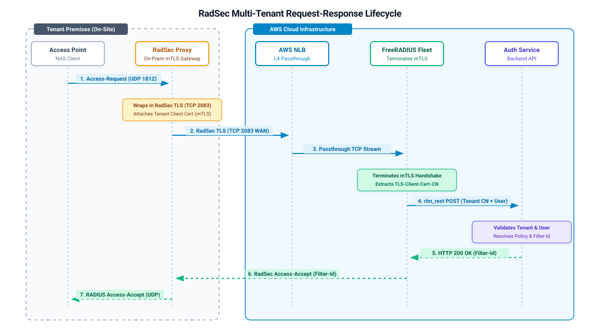
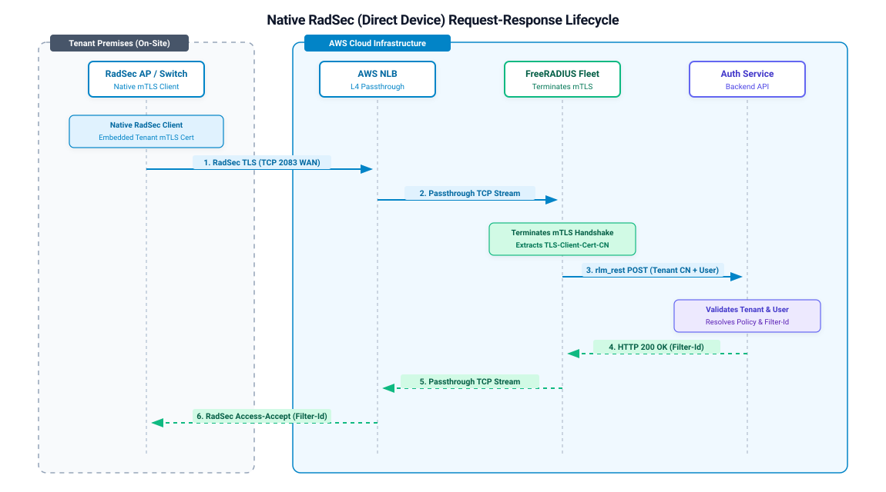

# Outline: Scaling Multi-Tenant RadSec on AWS

## 1. The Context: Real-World Experience & Multi-Tenancy
- Reflecting on building a multi-tenant RADIUS backend during a client project at Emumba for an enterprise SaaS solution.
- Framing the problem: Why standard single-tenant FreeRADIUS setups fail when serving multiple organizations in AWS.
- Protocol selection: Moving from legacy UDP RADIUS to RadSec (RADIUS over TLS / TCP on port 2083) + `rlm_rest` to dynamically resolve tenant policies (`Filter-Id`).

---

## 2. Target Architecture & Request Lifecycle

### System Architecture Diagram (Topology View)


* **Tenant Premises (On-Site)**: Legacy Access Points speak standard UDP 1812 to an On-Prem RadSec Proxy, which wraps traffic in RadSec TLS carrying the tenant's mTLS client certificate.
* **AWS Ingress**: Single AWS NLB instance performs L4 TCP Passthrough on port 2083 with sticky sessions.
* **Core Processing**: FreeRADIUS fleet terminates mTLS, extracts `%{TLS-Client-Cert-Common-Name}`, and queries the backend Auth Service via `rlm_rest` to dynamically return tenant-specific RADIUS reply attributes.

---

### Request-Response Sequence Diagrams (Lifecycle View)

#### Scenario A: Legacy APs via On-Prem RadSec Proxy


* **Step-by-Step Flow**:
  1. Access Point issues local UDP `Access-Request` (1812) to On-Prem RadSec Proxy.
  2. Proxy wraps payload into RadSec TLS (TCP 2083) with tenant mTLS certificate across the WAN.
  3. AWS NLB transparently routes TCP stream to FreeRADIUS.
  4. FreeRADIUS terminates TLS, extracts tenant CN, and issues HTTP POST via `rlm_rest` to Auth Service.
  5. Auth Service validates credentials and returns tenant policy (`Filter-Id`).
  6. FreeRADIUS forms `Access-Accept` with `Filter-Id` and returns it over the RadSec tunnel.
  7. On-Prem Proxy forwards standard RADIUS `Access-Accept` to Access Point.

#### Scenario B: Modern Devices with Native RadSec Support


* **Step-by-Step Flow**:
  1. Native RadSec AP / Switch initiates RadSec TLS (TCP 2083) directly across the WAN with its embedded tenant mTLS certificate.
  2. AWS NLB transparently routes the TCP stream to a FreeRADIUS target node.
  3. FreeRADIUS terminates mTLS, validates client certificate against trusted CA, and extracts `%{TLS-Client-Cert-Common-Name}`.
  4. FreeRADIUS executes `rlm_rest` HTTP POST with tenant CN and user credentials to the Auth Service.
  5. Auth Service validates credentials and returns tenant-specific policy (`Filter-Id`).
  6. FreeRADIUS constructs `Access-Accept` with `Filter-Id` and returns it directly across the established RadSec TLS tunnel.
  7. Native RadSec AP applies `Filter-Id` and grants user network access.

---

## 3. Alternative Architectural Options Evaluated

### Option 1: AWS NLB TLS Termination (Rejected)
* **Concept**: Terminate TLS at AWS NLB and pass plain TCP/RADIUS to FreeRADIUS.
* **Why it fails**:
  * Multi-tenant security relies on client certificates (mTLS) to trust and extract `tenant_id`.
  * AWS NLB terminates TLS at the edge but cannot inspect client certs or modify raw RADIUS packets to append tenant metadata.
  * FreeRADIUS receives plain RADIUS packets with zero visibility into which client certificate established the session.

### Option 2: Dedicated Reverse Proxy / RadSecProxy Fleet in AWS (Rejected)
* **Concept**: Place a stateful proxy fleet (e.g., RadSecProxy) in AWS between NLB and FreeRADIUS to handle TLS and rewrite RADIUS attributes.
* **Why it hurts**:
  * Introduces an extra stateful proxy tier in AWS that requires scaling, patching, and failover management.
  * Packet-level debugging (`tcpdump`, `radmin`, `radiusd -X`) across proxy hops becomes a painful diagnostic nightmare.
  * Adds unnecessary network hops and latency to every authentication request.

---

## 4. Essential AWS & FreeRADIUS Production Tuning

### 1. RadSec Connection Model vs. NLB Sticky Sessions
- **The Misconception:** Thinking AWS NLB sticky sessions route individual EAP round-trip packets to the same node.
- **The Reality:** RadSec runs over a persistent, long-lived TCP connection (port 2083). All EAP round-trips from an on-prem proxy already travel down the *same* TCP socket to the *same* FreeRADIUS EC2 target automatically. NLB client-IP stickiness only applies during the initial TCP 3-way handshake.
- **Real Scaling Challenges to Detail in the Post:**
  - **Hotspotting / Load Imbalance:** A massive branch campus with thousands of users will hold only 1–2 open TCP connections to the NLB, pinning all its traffic to a single FreeRADIUS instance.
  - **8-bit Packet ID Exhaustion (RFC 6614):** RADIUS headers use an 8-bit Identifier field (0–255), allowing at most 256 in-flight requests per TCP socket before packets queue or drop. Proxies must maintain connection pools with multiple TCP sockets per tenant.
  - **Auto-Scaling Group (ASG) Fleet Rebalancing Lag:** When an ASG scales out and launches new FreeRADIUS instances, they receive zero traffic from active branches until existing long-lived TCP streams close and reconnect.

### 2. Idle Timeouts, Silent Drops & Managed Connection Recycling
- **The Trap of the "6-Minute Rule" (Silent NAT / Conntrack Drops):**
  - If TCP connections simply idle out, AWS NLB and intermediate firewall NAT tables silently evict the route from their connection-tracking (conntrack) tables **without sending a `TCP RST` or `FIN`**.
  - Both the on-prem proxy and FreeRADIUS still believe the socket is `ESTABLISHED`.
  - When the first employee tries to authenticate in the morning, the proxy sends an `Access-Request` down the dead socket. The NLB silently drops it, causing a 5–10s timeout, retransmission storm, and a **"Cannot Join Wi-Fi"** failure.
- **Cold mTLS Handshake Latency Overhead:**
  - RadSec requires mutual TLS (mTLS). A fresh cold setup across WAN requires 3 RTTs (TCP 3-way handshake + TLS key/certificate exchange).
  - Over an 80ms WAN link, that is ~240ms of latency before the first RADIUS packet is even processed. Enterprise 802.1X supplicants have strict 3–5s timeouts for the *entire* EAP exchange.
- **The Production Pattern to Detail:**
  1. **Keep Sockets Hot While Active:** Use application-level `Status-Server` heartbeats or TCP keepalives (`SO_KEEPALIVE`, `tcp_keepalive_time = 30s`) to prevent NLB conntrack evictions.
  2. **Graceful Connection Recycling (Managed Refresh):** Configure the on-prem proxy with a **Max Connection Lifetime** (e.g., recycle cleanly every 1–2 hours or after $N$ requests). The proxy sends a clean TLS `close_notify` + `TCP FIN` *between* requests and re-opens a connection to the NLB. This smoothly distributes traffic across newly scaled FreeRADIUS ASG instances with zero dropped authentications.

### 3. `rlm_rest` Synchronous Worker Thread Saturation
- **The Bottleneck:** FreeRADIUS v3 worker threads block synchronously while waiting for `rlm_rest` HTTP calls to return.
- **The Thread Pool Math:**
  - Standard FreeRADIUS thread pool: `max_servers = 64`.
  - If the backend Auth Service responds in 150ms: a single FreeRADIUS instance maxes out at `64 / 0.15s ≈ 426 requests/sec`.
  - If the Auth Service experiences a temporary 1.5s latency spike (database contention, downstream auth provider lag), the entire 64-thread pool exhausts in under a second (`64 / 1.5s ≈ 42 req/sec capacity`), dropping incoming RADIUS packets and triggering NAS retransmission storms.
- **Required Production Mitigations:**
  - Strict connection pooling in `rlm_rest.conf` (`pool { start, min, max, spare }`) with HTTP/1.1 persistent connections (`keepalive = yes`).
  - Aggressive timeouts (`timeout = 2`, `connect_timeout = 1`) to fail fast rather than locking worker threads.
  - In-memory caching (`rlm_cache`) for repeated attribute queries and tenant policies.

```conf
# Reference: rlm_rest connection pool & timeout configuration
rest {
    connect_uri = "https://auth-api.internal.example.com/api/v1/radius/authorize"

    pool {
        start = 8
        min = 4
        max = 64
        spare = 4
        uses = 0
        retry_delay = 30
        lifetime = 0
        idle_timeout = 60
    }

    connect_timeout = 1.0
    timeout = 2.0

    authorize {
        uri = "${..connect_uri}"
        method = "post"
        body = "json"
        data = '{\
            "username": "%{User-Name}",\
            "tenant_id": "%{TLS-Client-Cert-Common-Name}",\
            "called_station_id": "%{Called-Station-Id}",\
            "calling_station_id": "%{Calling-Station-Id}"\
        }'
        tls = ${..tls}
    }
}
```

### 4. Dynamic Client Discovery & `unlang` Attribute Extraction
- **Dynamic WAN Endpoints:** Multi-tenant customer branch locations have dynamic public IPs, making static `clients.conf` entries impossible.
- **Dynamic Client Authorization:** FreeRADIUS terminates RadSec TLS and matches client certificates against a trusted private CA.
- **Unlang Tenant Resolution:** Extract `%{TLS-Client-Cert-Common-Name}` (or Subject Alternative Name / SAN) as the tenant identifier and map it directly into the `rlm_rest` authorization payload.

```unlang
# Reference: FreeRADIUS unlang snippet extracting tenant identity from RadSec mTLS
authorize {
    # Verify that the request arrived over TLS and has a verified client cert
    if (!"%{TLS-Client-Cert-Common-Name}") {
        reject
    }

    # Populate temporary attribute with tenant ID extracted from client certificate CN
    update control {
        &Tmp-String-0 := "%{TLS-Client-Cert-Common-Name}"
    }

    # Query backend multi-tenant REST API
    rest

    # Map returned tenant policy from REST response into standard reply
    if (updated) {
        update reply {
            &Filter-Id := "%{reply:Filter-Id}"
        }
    }
}
```

### 5. Accounting (`Accounting-Request`) Traffic Segregation
- **Volume Disparity:** RADIUS accounting volume (`Accounting-On`, `Accounting-Off`, `Start`, `Stop`, `Interim-Update`) is typically 5x–20x higher than authentication volume.
- **The Risk:** Querying `rlm_rest` synchronously for every 5-minute `Interim-Update` packet will starve authentication worker threads.
- **Architectural Solution:**
  - Segregate authentication and accounting into dedicated virtual servers / port listeners or separate target groups.
  - Buffer accounting packets locally to disk using `rlm_detail` and replay asynchronously with `radrelay`, or stream accounting events directly to an asynchronous broker (Kafka / Redis / SQS).

### 6. Health Checks: AWS NLB vs. FreeRADIUS Daemon State
- **L4 TCP Health Check Blindspot:** AWS NLB default health check on TCP port 2083 only verifies that the Linux kernel OS socket accepts a TCP handshake (`SYN/ACK`). If FreeRADIUS worker threads are locked waiting on hung `rlm_rest` calls, the kernel still accepts TCP connections, and NLB continues sending traffic to the broken node.
- **Application-Level Health Probe:**
  - Deploy a lightweight local HTTP health sidecar on each node that executes a synthetic local `radclient` query (or checks `Status-Server` via `radmin`).
  - Configure the AWS NLB target group to monitor this HTTP health endpoint rather than bare TCP port 2083.

### 7. The EAP-TLS MTU Advantage over RadSec
- **Legacy UDP MTU Trap:** Over WAN UDP, enterprise EAP-TLS certificate chains often exceed the 1500-byte Path MTU, leading to IP fragmentation, silent middlebox/firewall packet drops, and intermittent authentication failures.
- **RadSec Solution:** RadSec over TCP completely eliminates RADIUS MTU fragmentation issues through transparent native TCP stream segmentation.

---

## 5. Key Takeaways
- Don't overcomplicate RADIUS in the cloud with extra proxy tiers inside AWS.
- Use lightweight on-premises RadSec proxies for legacy hardware to bridge UDP to RadSec TLS.
- Let AWS NLB do fast L4 TCP passthrough, and let FreeRADIUS do what it was built for: native TLS and fast attribute processing.
- Account for long-lived TCP connection dynamics: active keepalives to prevent conntrack drops, managed connection recycling to prevent hotspotting and rebalance ASG nodes.
- Guard worker thread pools: tune `rlm_rest` pools and timeouts strictly, segregate high-volume accounting traffic, and use application-aware health checks.

---

## 6. Author Notes & Drafting Checklist (Reference)

### Draft Frontmatter Description Candidates (< 160 characters)
* *Option 1:* How we scaled multi-tenant FreeRADIUS on AWS using RadSec and rlm_rest — avoiding proxy bloat, thread pool lockups, and silent TCP connection drops. (152 chars)
* *Option 2:* Scaling FreeRADIUS for multi-tenant SaaS on AWS: why NLB TLS termination fails, how RadSec persistent TCP works, and production lessons with rlm_rest. (151 chars)
* *Option 3:* Real-world lessons from scaling multi-tenant RADIUS on AWS with RadSec: conntrack traps, rlm_rest thread pool exhaustion, and clean L4 architecture. (150 chars)

### Narrative & Voice Cues (To Keep the Raw, Personal Style)
- **The Emumba Client Story:** Start with the initial problem at Emumba — enterprise clients wanting cloud RADIUS for 802.1X Wi-Fi across multiple branches without running dedicated hardware per customer.
- **The Initial Failed Attempts:** Mention the temptation to terminate TLS at the NLB or run RadSecProxy clusters inside AWS, and why both were dead ends.
- **The Production War Story:** The realization that RadSec's persistent TCP meant NLB stickiness wasn't doing what the team thought it was, and the debugging session tracking down the morning "Cannot Join Wi-Fi" silent conntrack drop issue.
- **The Math Moment:** Walking through the $64 / 0.15s$ worker thread math that exposed how fragile unbuffered REST calls inside FreeRADIUS can be.

### Formatting & Pre-Publish Checklist
- [ ] Update frontmatter `description` with chosen hook.
- [ ] Change top `# Outline: Scaling Multi-Tenant RadSec on AWS` to direct introduction prose starting with `##` heading structure (as per `AGENT.md`).
- [ ] Verify image references: hero (`scaling-freeradius-aws.jpg`), topology diagram (`scaling-freeradius-architecture.png`), Scenario A (`scaling-freeradius-sequence.svg`), Scenario B (`scaling-freeradius-native-sequence.svg`).
- [ ] Remove this Section 6 reference block when prose drafting is complete.


