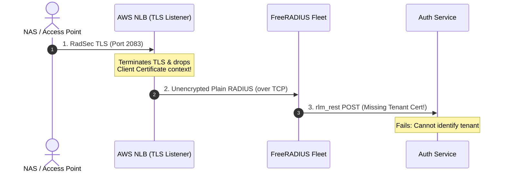
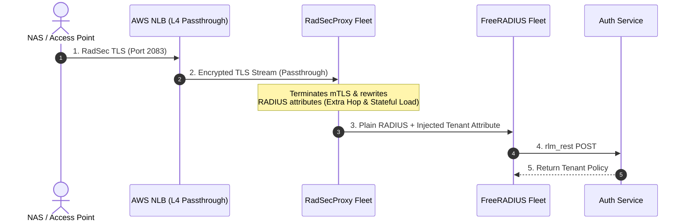
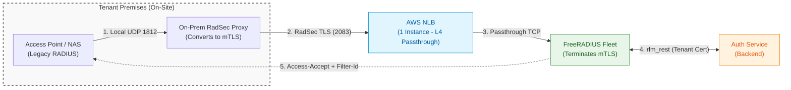
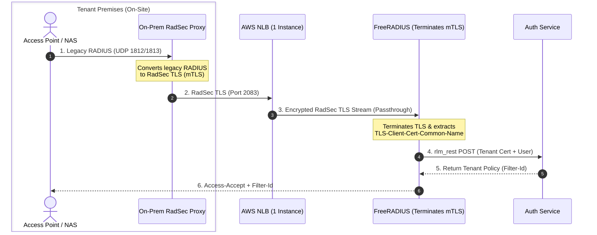

# Scaling FreeRADIUS on Cloud for Multi-Tenant Architecture

## 1. Why FreeRADIUS on Cloud? If thats still a question!
If you are here reading this post, chances are you know what you are doing as this post is very
specific to a very niche problem. FreeRADIUS powers the world's radius network authentications. Most of us use it without knowing much
about it. Telecoms, ISPs and enterprise networks are prime examples where FreeRadius is usually a defacto choice
as a server. 

At my work I had a chance to build a Cloud Network Access Control product from ground up. It offered RadSec secured 802.1x network authentications 
as a cloud service. FreeRADIUS was the obvious radius server choice for us and like usually with saas, it was a multi tenant solution focusing 
on cost optimization and efficiency. 

While building the product, we solved many problems over the years however the first one and the most important one was to scale the FreeRadius. 
Here are some of the problems one has to consider while designing a solution:
1. Radius is basically udp packets and not secure over public network. To counter this, you have to ensure that RadSec(Radius over TLS) is enabled. 
2. EAP authentications are stateful, there are multiple packet exchanges against each authentication request
3. Usage spikes at usual busy hours for instance in morning when people are signing in at office. 
During the day people roam around but its spontaneous throughout the day.
4. 

- Reflecting on building a multi-tenant RADIUS backend during a client project at Emumba for an enterprise SaaS solution.
- Framing the problem: Why standard single-tenant FreeRADIUS setups fail when serving multiple organizations in AWS.
- Protocol selection: Moving from legacy UDP RADIUS to RadSec (RADIUS over TLS / TCP on port 2083) + `rlm_rest` to dynamically resolve tenant policies (`Filter-Id`).

---

## 2. Comparing the 3 Architectural Options

### Scenario 1: AWS NLB TLS Termination (Rejected)

* **Why it fails**:
  * Multi-tenant security relies on client certificates (mTLS) to trust and extract `tenant_id`.
  * AWS NLB terminates TLS at the edge but **cannot inspect client certs or modify raw RADIUS packets** to append tenant metadata.
  * FreeRADIUS receives plain RADIUS packets with zero visibility into which client certificate established the session.

---

### Scenario 2: Dedicated Reverse Proxy / RadSecProxy Fleet in AWS (Rejected)

* **Why it hurts**:
  * Introduces an extra stateful proxy tier in AWS that requires scaling, patching, and failover management.
  * Packet-level debugging (`tcpdump`, `radmin`, `radiusd -X`) across proxy hops becomes a painful diagnostic nightmare.
  * Adds unnecessary network hops and latency to every authentication request.

---

### Scenario 3: Direct FreeRADIUS TLS Termination behind AWS NLB with On-Prem RadSec Proxy (Recommended)

* **Why it wins**:
  * **Legacy Compatibility**: On-premises RadSec Proxy allows legacy Access Points (which can't speak RadSec natively) to send standard UDP RADIUS locally within the tenant premises, while securing the WAN link to AWS over RadSec TLS.
  * **Security**: Preserves end-to-end mTLS across the WAN. FreeRADIUS directly reads `%{TLS-Client-Cert-Common-Name}` from the tenant's RadSec proxy cert in `unlang` and securely forwards it to `rlm_rest`.
  * **Simplicity**: AWS NLB acts purely as a fast, cheap L4 TCP passthrough balancer.
  * **Scalability**: FreeRADIUS nodes scale horizontally in AWS (ECS/EKS/EC2) alongside TLS handshake workloads.

---

## 3. Essential AWS & FreeRADIUS Production Tuning

### EAP Stateful Sticky Sessions
- EAP authentication (EAP-TLS, EAP-PEAP) requires multiple round-trip packets between client and server.
- Must enable **Sticky Sessions on AWS NLB** so all packets within an EAP session route to the same FreeRADIUS target instance.

### Idle Timeout Alignment (The 6-Minute Rule)
- Prevent connection state drift between AWS infrastructure and FreeRADIUS.
- Set `idle_timeout` to **6 minutes (360 seconds)** on both AWS NLB TCP target groups and FreeRADIUS listener configuration to ensure synchronized connection teardown.

### `rlm_rest` Attribute Mapping
- Extracting tenant identity from RadSec client certs in FreeRADIUS `unlang`.
- Relaying request attributes to the multi-tenant backend API and returning tenant-specific RADIUS reply attributes (e.g., `Filter-Id`).

---

## 4. Key Takeaways
- Don't overcomplicate RADIUS in the cloud with extra proxy tiers inside AWS.
- Use lightweight on-premises RadSec proxies for legacy hardware to bridge UDP to RadSec TLS.
- Let AWS NLB do fast L4 TCP passthrough, and let FreeRADIUS do what it was built for: native TLS and fast attribute processing.
