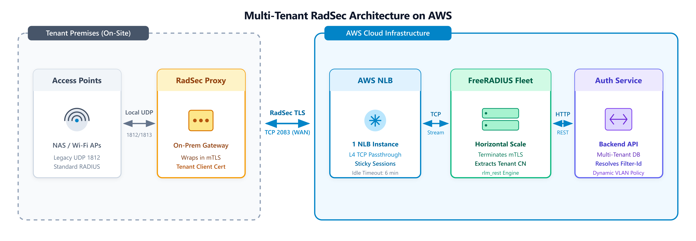

# Outline: Scaling Multi-Tenant RadSec on AWS

## 1. The Context: Real-World Experience & Multi-Tenancy
- Reflecting on building a multi-tenant RADIUS backend during a client project at Emumba for an enterprise SaaS solution.
- Framing the problem: Why standard single-tenant FreeRADIUS setups fail when serving multiple organizations in AWS.
- Protocol selection: Moving from legacy UDP RADIUS to RadSec (RADIUS over TLS / TCP on port 2083) + `rlm_rest` to dynamically resolve tenant policies (`Filter-Id`).

---

## 2. Target Architecture & Request Lifecycle

### System Architecture Diagram (Topology View)

* **Tenant Premises (On-Site)**: Legacy Access Points speak standard UDP 1812 to an On-Prem RadSec Proxy, which wraps traffic in RadSec TLS carrying the tenant's mTLS client certificate.
* **AWS Ingress**: Single AWS NLB instance performs L4 TCP Passthrough on port 2083 with sticky sessions.
* **Core Processing**: FreeRADIUS fleet terminates mTLS, extracts `%{TLS-Client-Cert-Common-Name}`, and queries the backend Auth Service via `rlm_rest` to dynamically return tenant-specific RADIUS reply attributes.

---

### Request-Response Sequence Diagram (Lifecycle View)

* **Step-by-Step Flow**:
  1. Access Point issues local UDP Access-Request to On-Prem RadSec Proxy.
  2. Proxy wraps payload into RadSec TLS (TCP 2083) with tenant mTLS certificate across the WAN.
  3. AWS NLB transparently routes TCP stream to FreeRADIUS.
  4. FreeRADIUS terminates TLS, extracts tenant CN, and issues HTTP POST via `rlm_rest` to Auth Service.
  5. Auth Service validates credentials and returns tenant policy (`Filter-Id`).
  6. FreeRADIUS forms `Access-Accept` with `Filter-Id` and returns it over the RadSec tunnel.
  7. On-Prem Proxy forwards standard RADIUS `Access-Accept` to Access Point.

---

## 3. Alternative Architectural Options Evaluated

### Option 1: AWS NLB TLS Termination (Rejected)
* **Concept**: Terminate TLS at AWS NLB and pass plain TCP/RADIUS to FreeRADIUS.
* **Why it fails**:
  * Multi-tenant security relies on client certificates (mTLS) to trust and extract `tenant_id`.
  * AWS NLB terminates TLS at the edge but cannot inspect client certs or modify raw RADIUS packets to append tenant metadata.
  * FreeRADIUS receives plain RADIUS packets with zero visibility into which client certificate established the session.

### Option 2: Dedicated Reverse Proxy / RadSecProxy Fleet in AWS (Rejected)
* **Concept**: Place a stateful proxy fleet (e.g., RadSecProxy) in AWS between NLB and FreeRADIUS to handle TLS and rewrite RADIUS attributes.
* **Why it hurts**:
  * Introduces an extra stateful proxy tier in AWS that requires scaling, patching, and failover management.
  * Packet-level debugging (`tcpdump`, `radmin`, `radiusd -X`) across proxy hops becomes a painful diagnostic nightmare.
  * Adds unnecessary network hops and latency to every authentication request.

---

## 4. Essential AWS & FreeRADIUS Production Tuning

### EAP Stateful Sticky Sessions
- EAP authentication (EAP-TLS, EAP-PEAP) requires multiple round-trip packets between client and server.
- Must enable **Sticky Sessions on AWS NLB** so all packets within an EAP session route to the same FreeRADIUS target instance.

### Idle Timeout Alignment (The 6-Minute Rule)
- Prevent connection state drift between AWS infrastructure and FreeRADIUS.
- Set `idle_timeout` to **6 minutes (360 seconds)** on both AWS NLB TCP target groups and FreeRADIUS listener configuration to ensure synchronized connection teardown.

### `rlm_rest` Attribute Mapping
- Extracting tenant identity from RadSec client certs in FreeRADIUS `unlang`.
- Relaying request attributes to the multi-tenant backend API and returning tenant-specific RADIUS reply attributes (e.g., `Filter-Id`).

---

## 5. Key Takeaways
- Don't overcomplicate RADIUS in the cloud with extra proxy tiers inside AWS.
- Use lightweight on-premises RadSec proxies for legacy hardware to bridge UDP to RadSec TLS.
- Let AWS NLB do fast L4 TCP passthrough, and let FreeRADIUS do what it was built for: native TLS and fast attribute processing.
